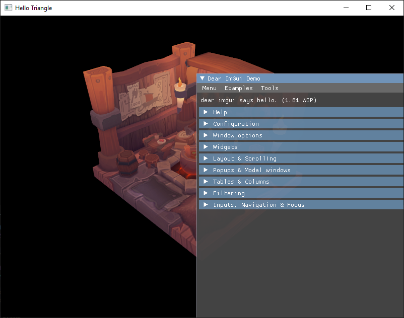

# 1/31/21

Yesterday I added in the final parts from the tutorial: mipmapping and multisampling. I think the best way to really test it and see it in action would be to add some controls. A quick way would be to poll key events, but the cooler way would be to add ImGui.

It looks like there are a few posts out there that go into integrating ImGui. I thought it was going to be a straightforward plug and chug library, but it is way more involved that I thought.

A really really really stupid mistake: Tried to include the files without adding them to visual studio. :upside_down_smiley:

Based on the SaschaWillems sample, he created a new class for ImGui that also has the Vulkan rendering contexts.

# 2/14/21
Finally had time to sit and actually read through the blog post carefully. I also had to read through the Vulkan stuff again just to get a refresher. 

Followed François Guthmann's post and was able to get ImGui fully integrated and running. 

Points of confusion for me were:
- Should we still use the same swap chain?
- Do we need to create separate resources? (descriptor sets, command pools, command buffers, etc.)
    - Yes, for clarity and to prevent overloading current resources. This might be a performance hit, but not too worried about it.
- Do we need multiple render passes? 
    - Yes, this was explicitly said in the post had I read carefully.
- How to sync the main render pass and the ImGui pass? 
    - Use a dependency - when the first pass is finished we initiate the imgui pass. 

Looking through the example code, it looks like we *shouldn't* be using the functions given. But the idea was to see how the pieces fit together to create my own API for it. 

## Issues
I ran into a few validation errors which were mainly on the final layouts of the images. Because ImGui is supposed to be drawn over the image in the frame buffer, the previous layouts should not be "present".

However, this didn't completely fix it. There was still a mismatch with the final layout and the one being sent to the command buffer. On top of that, everything was flickering. To debug this, I wrapped all the ImGui calls around a macro so that I can test to make sure the regular rendering was still working. 

The point that I messed up was indexing the command buffer - I was using the current frame rather than the index in the swap chain. This cleared the flickering and the validation errors!

## Resources
- https://frguthmann.github.io/posts/vulkan_imgui/
- https://github.com/SaschaWillems/Vulkan/blob/master/examples/imgui/main.cpp