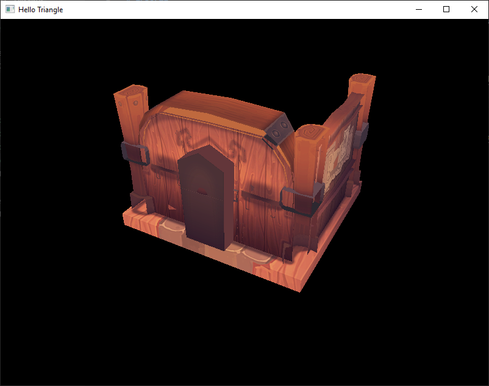
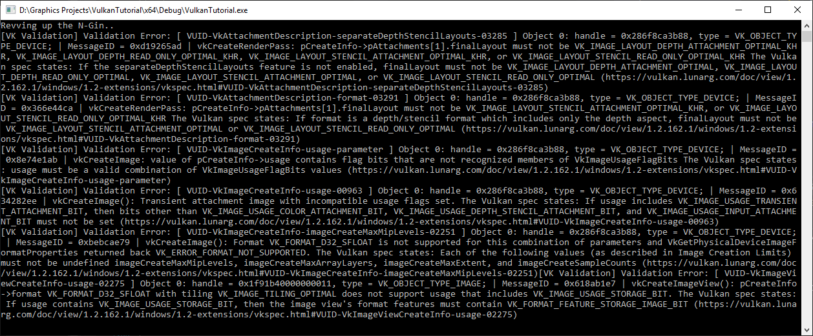
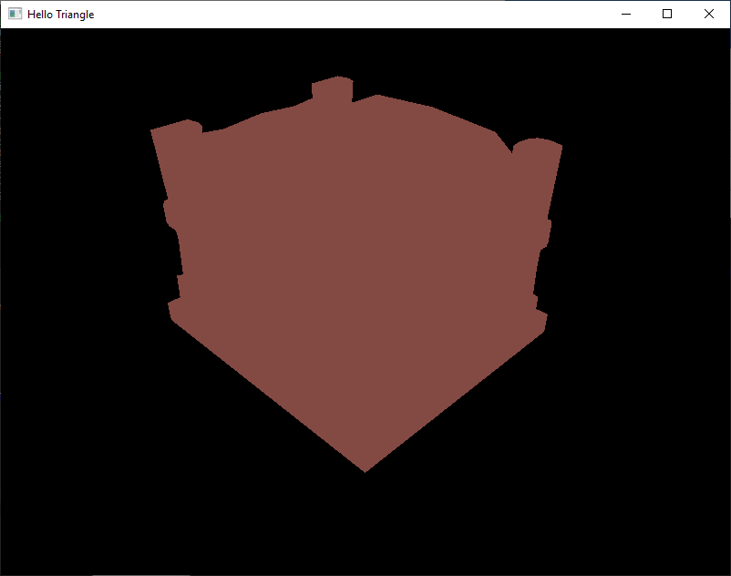
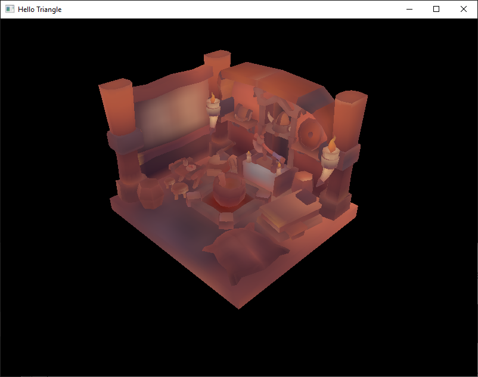
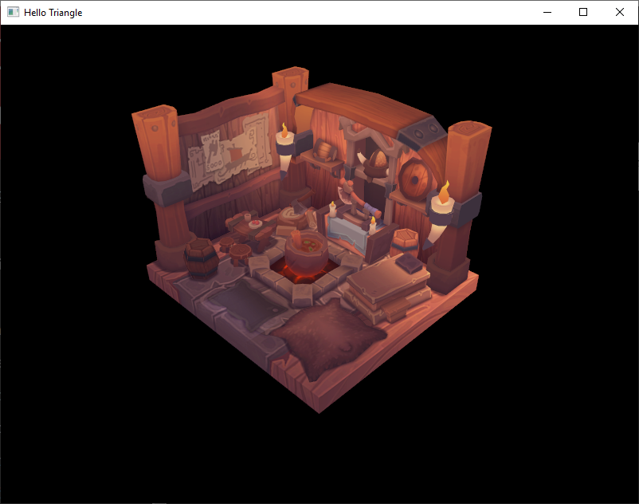

# 1/30/21

Spent today trying to figure out the remaining bugs from finishing the tutorial.

## Visual errors


There are two problems here:
The first problem here is that `rasterizer.cullMode = VK_CULL_MODE_BACK_BIT;` which causes the disappearing backsides of the mesh. 

When we turn off culling we can see the backfaces but there is still something off about the mesh.

| Front | Back |
|:---:|:---:|
|||

The issue now is that the viewport depth is [0, 0], changing this to [0, 1] fixes it. The only way I can make sense of this is that when the max depth is 0, there's no way for the rasterizer to tell which triangles are farther away and won't write to the depth buffer.

| Before | After |
|:---:|:---:|
|||
|||

## Validation errors
There was also a few validation errors:


The first validation error is in setting up the `depthAttachment`, the final layout was `VK_IMAGE_LAYOUT_STENCIL_ATTACHMENT_OPTIMAL` where it should be `VK_IMAGE_LAYOUT_DEPTH_STENCIL_ATTACHMENT_OPTIMAL`. 

The second validation error is in `CreateDepthResources()`, `VK_IMAGE_LAYOUT_STENCIL_ATTACHMENT_OPTIMAL` should be `VK_IMAGE_USAGE_DEPTH_STENCIL_ATTACHMENT_BIT`. `CreateImage` asks for a usage flag not a layout flag.

## Mipmapping

Hit this validation error following the tutorial:
```
[VK Validation] Validation Error: [ VUID-VkImageMemoryBarrier-oldLayout-01212 ] Object 0: handle = 0x99e2bc0000000019, type = VK_OBJECT_TYPE_IMAGE; | MessageID = 0xff795e16 | vkCmdPipelineBarrier(): Image barrier pImageMemoryBarrier[0] new Layout=VK_IMAGE_LAYOUT_TRANSFER_SRC_OPTIMAL is not compatible with VkImage 0x99e2bc0000000019[] usage flags 0x6. The Vulkan spec states: If srcQueueFamilyIndex and dstQueueFamilyIndex define a queue family ownership transfer or oldLayout and newLayout define a image layout transition, and oldLayout or newLayout is VK_IMAGE_LAYOUT_TRANSFER_SRC_OPTIMAL then image must have been created with VK_IMAGE_USAGE_TRANSFER_SRC_BIT set (https://vulkan.lunarg.com/doc/view/1.2.162.1/windows/1.2-extensions/vkspec.html#VUID-VkImageMemoryBarrier-oldLayout-01212)
```

Mipmapping is using the same texture as the source and destination, I needed to add `VK_IMAGE_USAGE_TRANSFER_SRC_BIT` to the usage when creating the image.

A second validation error:
```
[VK Validation] Validation Error: [ VUID-VkSamplerCreateInfo-maxLod-01973 ] Object 0: handle = 0x1bd7c7acc58, type = VK_OBJECT_TYPE_DEVICE; | MessageID = 0xbb1ef6f1 | vkCreateSampler(): minLod (11.000000) is greater than maxLod (0.000000) The Vulkan spec states: maxLod must be greater than or equal to minLod (https://vulkan.lunarg.com/doc/view/1.2.162.1/windows/1.2-extensions/vkspec.html#VUID-VkSamplerCreateInfo-maxLod-01973)
```

The issue here was that the minLod and maxLod were flipped, pretty simple here.

This is also when `lod = [mipLevels, mipLevels]`


This is `lod = [mipLevels / 2, mipLevels]`


Adding imgui controls would be ideal to test.

## Multisampling
