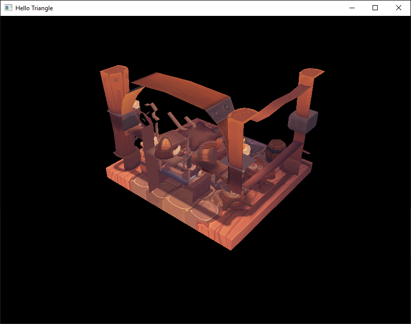
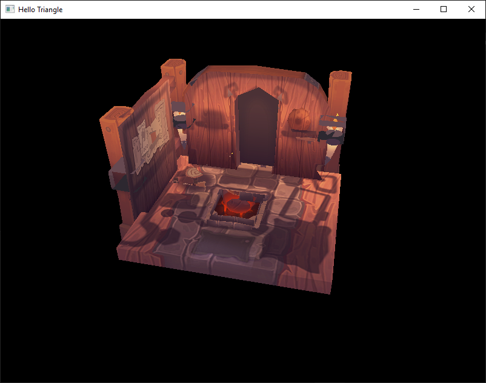
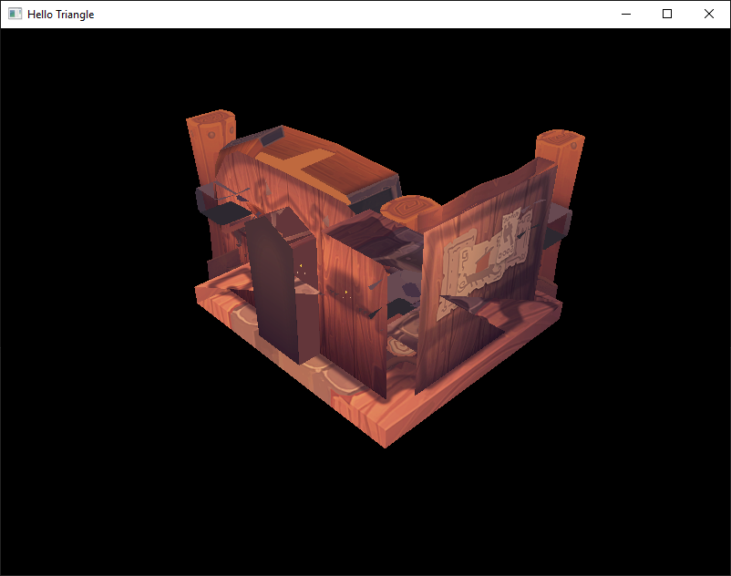
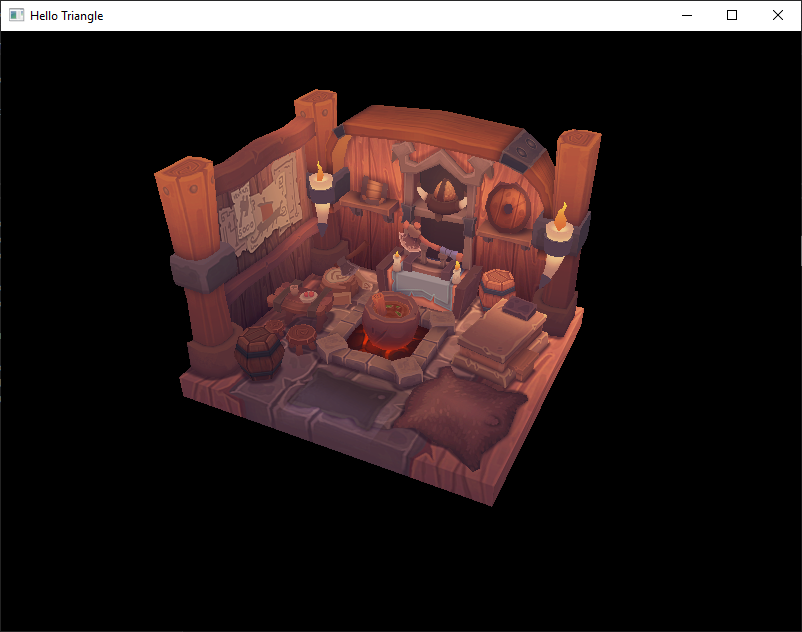

# 1/30/21

Spent today trying to figure out the remaining bugs from finishing the tutorial.

## Visual errors

There are two problems here:
The first problem here is that `rasterizer.cullMode = VK_CULL_MODE_BACK_BIT;` which causes the disappearing backsides of the mesh. 

When we turn off culling we can see the backfaces but there is still something off about the mesh.

| Front | Back |
|:---:|:---:|
|||

The issue now is that the viewport depth is [0, 0], changing this to [0, 1] fixes it. The only way I can make sense of this is that when the max depth is 0, there's no way for the rasterizer to tell which triangles are farther away and won't write to the depth buffer.

| Before | After |
|:---:|:---:|
|||
|||

## Validation errors
There was also a few validation errors:

The first validation error is in setting up the `depthAttachment`, the final layout was `VK_IMAGE_LAYOUT_STENCIL_ATTACHMENT_OPTIMAL` where it should be `VK_IMAGE_LAYOUT_DEPTH_STENCIL_ATTACHMENT_OPTIMAL`. 

The second validation error is in `CreateDepthResources()`, `VK_IMAGE_LAYOUT_STENCIL_ATTACHMENT_OPTIMAL` should be `VK_IMAGE_USAGE_DEPTH_STENCIL_ATTACHMENT_BIT`. `CreateImage` asks for a usage flag not a layout flag.